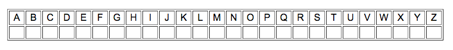
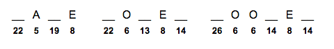
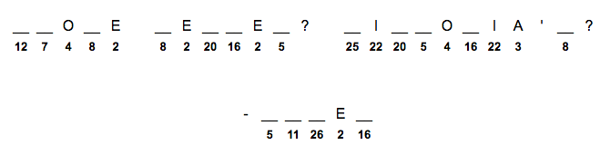
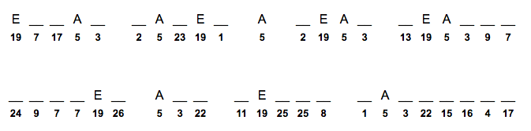
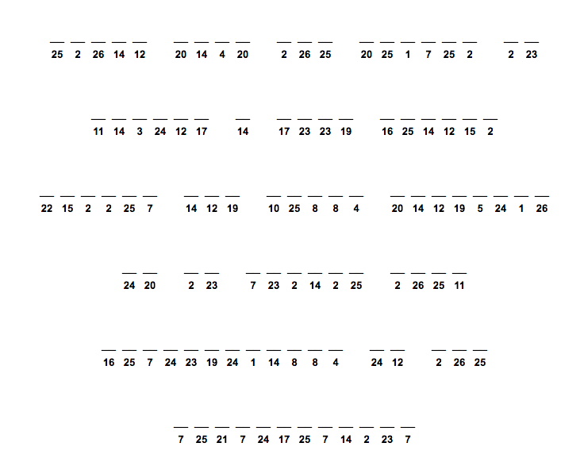

# Warmup exercise: cryptogram
## Time limit: 15 minutes

## Background

Encryption is a powerful tool which has been used for centuries to protect
inormation. The sender of a piece of information scrambles it so that only the
holder of a key can decrypt and access the information.

A cryptogram is a simple puzzle that involves decoding a message encrypted using
something called a [substitution
cipher](https://en.wikipedia.org/wiki/Substitution_cipher), where each letter is
swapped for another letter or a number.

## Goal

Try your hand at solving the following cryptograms (in order of increasing
difficulty). You may find it useful to fill in a key such as the following as
you work:

### Puzzle 1

Hint: Horizons staff have strong feelings for one another.

### Puzzle 2

Hint: #quotes

### Puzzle 3

Hint: We have some very talented people here. I'm hungry.

### Bonus! Puzzle 4

Hint: Now maybe you can do it yourself!
